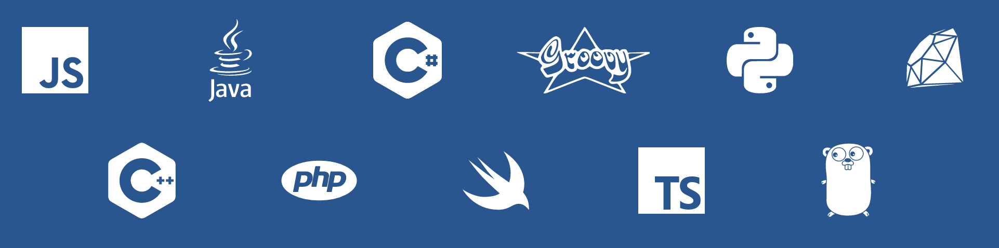

## What's this contest all about?
Improving the quality of your code with the [Better Code Hub](https://bettercodehub.com) - a [GitHub Integration](https://github.com/integrations/better-code-hub) provided by [Software Improvement Group (SIG)](https://www.sig.eu).

## Who can take part?
Developers attending the [Autonomous Vehicle Technology World Expo](http://www.autonomousvehicletechnologyworldexpo.com)

## When's it happening?
Right up until the event, through 19 June 2017

## How will the winner be determined?
The [Better Code Hub](https://bettercodehub.com) scores your team's code against our 10 guidelines for maintanable software. The team with the highest score wins! 

The winner will be notified and presented with a prize at the SIG booth (AV6000) during the exhibition.

## How do I enter?
**Two easy steps:**
1. Go to [bettercodehub.com](https://bettercodehub.com) and log in [FREE] with your GitHub account

Private repo? E-mail your name and personal GitHub handle to [bettercodehub@sig.eu](mailto:bettercodehub@sig.eu) and mention Autonomous Vehicle Technology World Expo.

2. Send us a Pull Request with your Better Code Hub badge code [here](https://github.com/bettercodehubcontest/bettercodehubcontest.github.io/blob/master/BCHScoreBoard.md) or send us an e-mail with your badge code. 

## More Contest Details
**Supported Languages**

For a full list of the supported technologies, including Solidity, check [here](https://bettercodehub.com/docs/configuration-manual).

**Zero set-up time**

Using Better Code Hub is easy. Just head over to [bettercodehub.com](https://bettercodehub.com) and login with your GitHub account. You'll then see your repos, and you can start an analysis clicking the ▶️ button. 

If you want Better Code Hub to run for every Push and Pull Request on your repo, click the ⚙ icon and toggle the switch:

**Excluding files from analysis**

Better Code Hub analyses all the code that is in your repository. This might include all the external libraries that you use. 

First do an initial analysis of your repository, so the "Analysis configuration" option becomes available. Then you can exclude these files by creating a **.bettercodehub.yml** configuration file located in the root of your repository. The code that goes into this file, can be generated with the "Analysis configuration" page which contains the following widget:

You can find this page by first clicking on the ⚙ icon and then clicking on "Analysis configuration". 

The resulting configuration file might look like:

~~~~
exclude:
- /mylibrary/src/.*
component_depth: 1
languages:
- java
- solidity
~~~~

Of course, you can create the configuration file directly, and place it to the root of your repository. For details check the [configuration manual](https://bettercodehub.com/docs/configuration-manual).

* **Solidity** in your repo? To analyze that languange too please add [- solidity] to the configuration file as shown in the example above. 

**Support and PRO License** 

* If needed, get support through bettercodehub@sig.eu

**We'd like to hear from you**
Don't hesitate to send us feedback at [bettercodehub@sig.eu](mailto://bettercodehub@sig.eu]). 

**Let's build some great software** 😊

Go, go, go and see you at the Autonomous Vehicle Technology World Expo!

[Maria](https://github.com/mtsheeran) and [Kay](https://github.com/grosskop)

